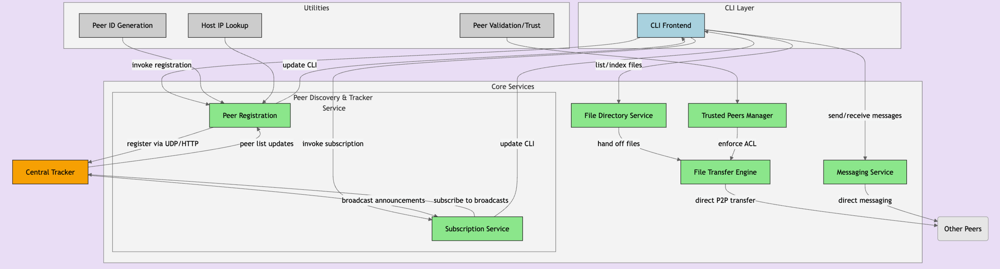
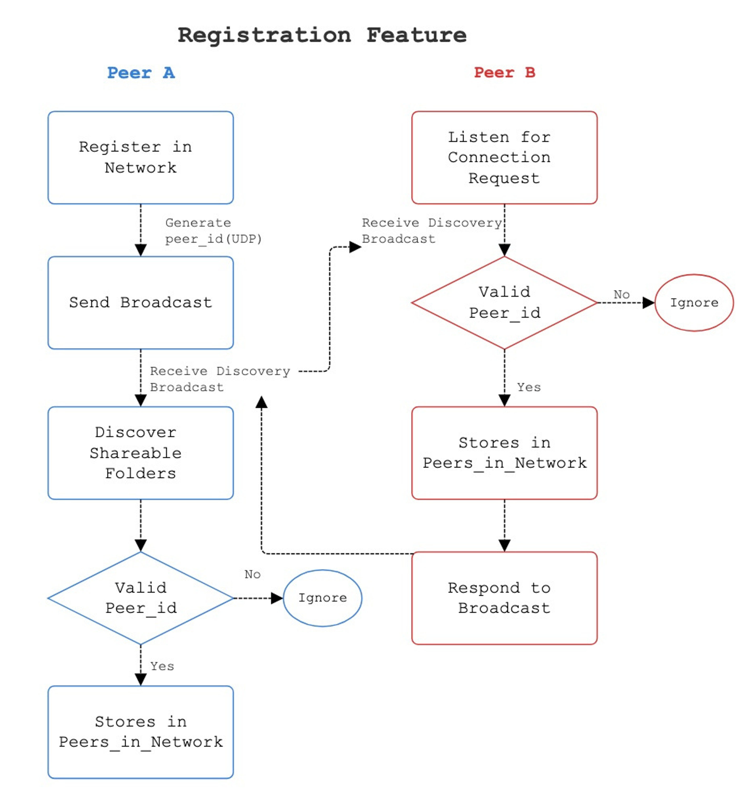
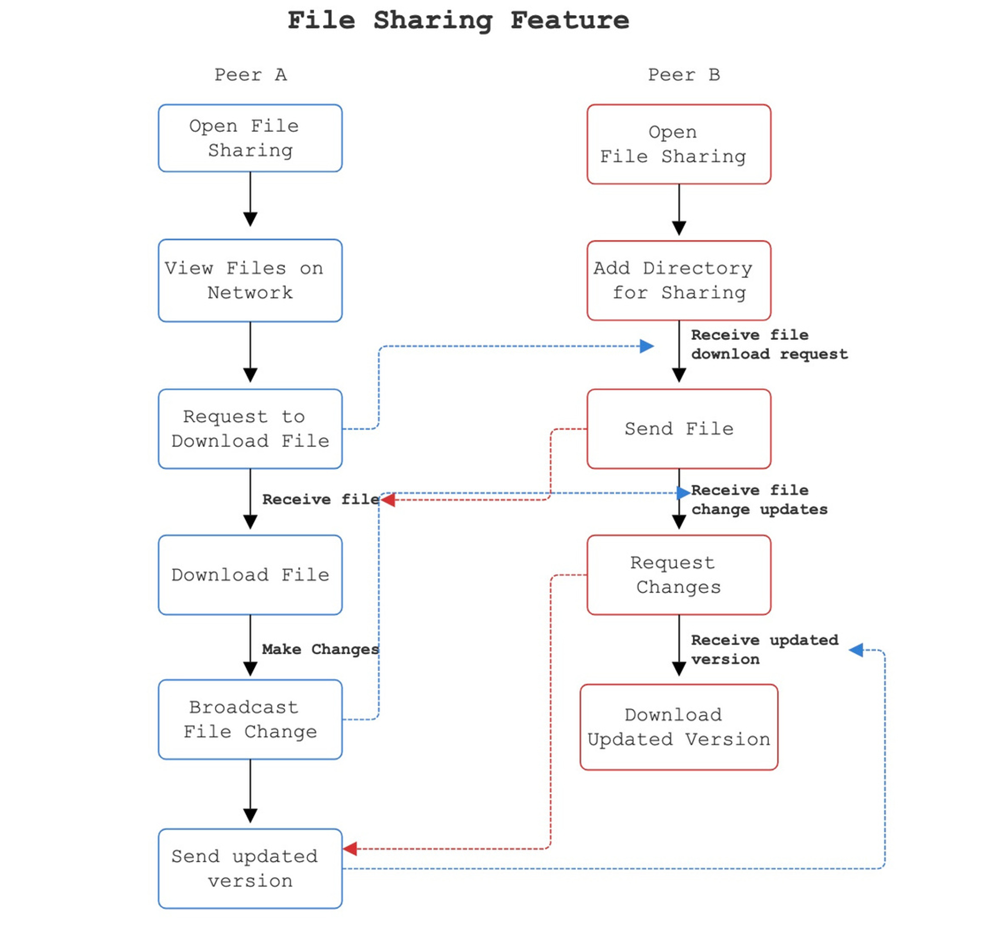

# p2p-file-synchronization-group-3
What is a P2P File Synchronization Application?
	A P2P (peer-to-peer) file synchronization application allows users within a local network to share and download files efficiently. Unlike traditional file-sharing methods, this application enables decentralized file distribution while relying on a central server for peer discovery.

How to use this application:

Using this application is straightforward. The main menu provides various options to navigate and interact with the network. The first step is to register in the network—this is required before using any features.

# How to Run the Code

Make sure all necessary libraries are installed and run main.py

# Main Menu Options: 

  View Peers in the Network - Displays a list of currently active peers.
  
  Files Center: 
  
    Shows available files for download.
    
    View public files (Lists public files and their IDs, allowing users to download files by their unique ID.)
    
    View private files (Similar to public files but restricted to trusted peers.)
    
    Download File by ID - Requests a file by its ID. Access may be denied for private files unless the requester is on the owner's trusted       list.
    
  Messaging Center:
  
    View Messages - Displays messages received from other peers.
    
    Reply to a Message - Respond to a message using the user_id
    
    Send message to all peers
    
  Manage Trusted Peers:
    
    Add a User to Trusted List - Grants a user permission to access private files. (Caution: Trusted users can download all private files.)
    
    Remove user from trusted list of peers

  Folder Subscription Feature:
    
    As a peer, you can share any folder to the network for other people to subscribe to
    
    As a peer, you can subscribe to any folder that is shared across the network

    Once you subscribe to a folder, any changes that a peer that is subscribed to that folder makes, the changes will reflect on your machine and you will receive the latest version of the files.

    
  Deregister/Exit:
  
    Broadcasts a message to notify peers that you are leaving the network

# Key Features & Automation:

This application is designed to be simple and user-friendly. We automate key processes to minimize manual effort:

  Automatic File Sharing:

    Public files are shared automatically across the network.
  
    Private files are shared automatically only with trusted peers.

  Seamless Peer Discovery:
  
    Peers are discovered automatically in the background, eliminating the need for manual peer searches.
    
    As of right now, this feature is not yet implemented and you are required to use the discover peer method.

# P2P Architecture

Our code handles how peers join and interact within the network. When a peer starts the program, it generates a unique ID combining the username, IP address, and port number. The peer then broadcasts its ID using UDP, allowing other peers on the local network to discover it without needing a central server. When a peer receives a broadcast, it validates the incoming ID and adds the new peer to its local list, responding with its own ID to complete a two-way discovery. This system ensures that all peers are aware of each other and can synchronize files, messages, and updates automatically.
Files are transferred directly between peers over TCP connections.
Messaging and folder subscriptions are layered on top of the file sync core.
Private file access is enforced via a trusted peer list (ACL).
Folder changes are automatically detected and broadcast to peers in real-time.

# Diagrams

# FAQs & Support:

How do I download a private file?

    To download a private file, you must first message the file owner. Once they trust you and add you to their trusted peers list,
    you can download any private file they share by using the file ID.

Can I block a specific user?

    No, you cannot block a user.
  
    However, private files are only accessible to trusted peers, providing a level of security.

How do you prevent spam in the network?
 
To mitigate spam:
    
    Users can only send one message at a time to another user until they receive a reply.
    
    File sharing is limited to a maximum of three public and three private files per user, preventing users from flooding the network with    excessive files.
    
Security & Privacy Considerations:

    Private files are only accessible to trusted peers.
    
    Messages are limited to prevent spam.
    
    Peers must register before accessing the network.
    
    Deregistering removes peer access to files.
